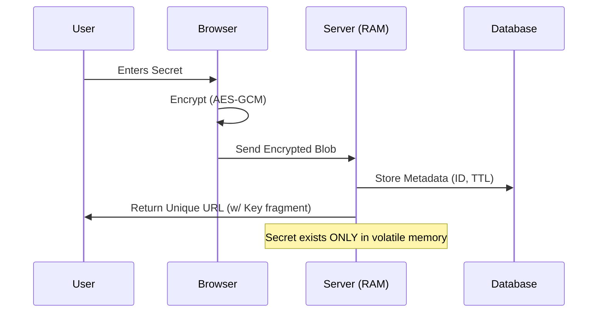

# 🔒 Whisp - Ephemeral Secret Sharing

<div align="center">


**A self-hosted, zero-knowledge secret sharing platform built with the PETAL Stack.**
Secrets are encrypted in the browser, stored in RAM, and destroyed upon access.

[Live Demo](https://whisp.cavydev.com) • [Report Bug](https://github.com/adam-benyekkou/whisp/issues)

</div>

---

## 🛡️ Security Architecture

Whisp is designed with a **Zero-Trust** and **Privacy-First** philosophy.

*   **Zero-Knowledge Encryption**: Secrets are encrypted **client-side** using the Web Crypto API (AES-GCM 256-bit). The server **never** receives the plaintext or the decryption key (which is passed via the URL fragment `#`).
*   **RAM-Only Storage (tmpfs)**: Encrypted payloads are stored in a Docker `tmpfs` volume. Data is never written to the physical disk, preventing forensic recovery.
*   **Ephemeral Lifecycle**: Data is automatically nuked from memory after **one access** or when the **TTL (Time-To-Live)** expires.
*   **Double-Blind Key**: For files, the server generates a unique transit key that is never stored in the database, ensuring that even a database dump yields useless metadata.

### 🧠 The Data Flow



---

## 🚀 Deployment

Whisp is distributed as a lightweight Docker container.

### Option 1: Docker Compose (Recommended)

```yaml
services:
  whisp:
    image: ghcr.io/adam-benyekkou/whisp-secret:latest
    container_name: whisp
    restart: unless-stopped
    ports:
      - "8000:8000"
    environment:
      - DATABASE_URL=sqlite+aiosqlite:////app/data/whisp.db
      - MAX_FILE_SIZE=10485760 # 10MB
    volumes:
      - ./data:/app/data
    tmpfs:
      # 🔒 CRITICAL: Stores secrets in RAM only
      - /app/data/storage:size=100M,mode=1777
```

**Run the stack:**

```bash
mkdir -p data && sudo chown -R 1000:1000 data
docker compose up -d
```

### Option 2: Environment Configuration

| Variable | Description | Default |
| :--- | :--- | :--- |
| `DATABASE_URL` | Async connection string | `sqlite+aiosqlite:///...` |
| `STORAGE_DIR` | Path for ephemeral storage | `/app/data/storage` |
| `MAX_FILE_SIZE` | Max upload size (bytes) | `10485760` (10MB) |
| `DEBUG` | Toggle debug mode | `false` |

---

## 🧪 Testing & Quality Assurance

This project maintains rigorous code quality standards using Playwright for End-to-End (E2E) testing.

**Test Coverage:**
*   ✅ **Zero-Knowledge verification**: Ensuring plaintext never leaves the browser.
*   ✅ **Destruction verification**: Confirming 404s after single access.
*   ✅ **TTL Expiration**: Verifying background cleanup tasks.

```bash
# Run the full test suite
npm install
npx playwright install chromium
npx playwright test
```

---

## 🛠️ Tech Stack

*   **Frontend**: PETAL (Python, Alpine.js, Tailwind CSS)
*   **Backend**: FastAPI (Async Python 3.11)
*   **Database**: SQLite (Async via aiosqlite)
*   **Infrastructure**: Docker, Docker Compose, GitHub Actions

---

## 📄 License

Distributed under the MIT License. See `LICENSE` for more information.

